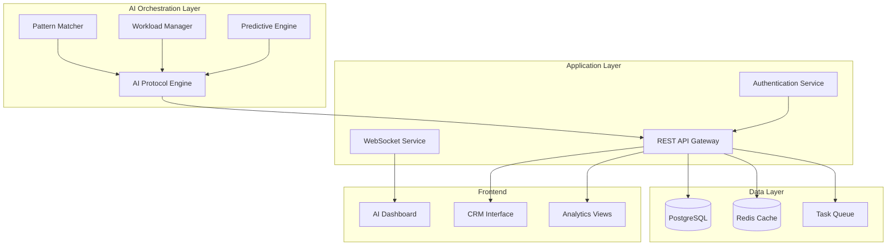

# AI-First CRM Platform

An intelligent Customer Relationship Management system where AI serves as the central orchestration layer, managing workloads, identifying patterns, and optimizing business processes autonomously.

## Vision

This CRM platform reimagines traditional customer relationship management by positioning AI as the primary decision-making entity. Rather than AI being a feature, it becomes the core protocol that:

- **Orchestrates Workloads**: Automatically distributes tasks, prioritizes activities, and manages resource allocation
- **Pattern Recognition**: Continuously analyzes customer interactions, sales patterns, and team performance to identify opportunities and risks
- **Predictive Management**: Anticipates customer needs, forecasts sales outcomes, and suggests proactive interventions
- **Autonomous Operations**: Handles routine tasks, schedules follow-ups, and maintains data quality without human intervention

## Architecture Overview



## Core Components

### 1. AI Protocol Engine
The central intelligence that makes autonomous decisions about:
- Task prioritization and assignment
- Customer interaction timing
- Resource allocation optimization
- Process automation triggers

### 2. Pattern Recognition System
Continuously analyzes:
- Customer behavior patterns
- Sales cycle trends
- Team performance metrics
- Market opportunity signals

### 3. Workload Management
Automatically handles:
- Task distribution based on team capacity
- Deadline management and escalation
- Resource balancing across projects
- Performance optimization

### 4. Predictive Analytics
Provides insights on:
- Customer lifetime value predictions
- Sales forecast accuracy
- Churn risk assessment
- Opportunity scoring

## Technology Stack

### Backend
- **Python FastAPI**: High-performance API framework
- **PostgreSQL**: Primary database with JSONB for flexible data
- **Redis**: Caching and real-time data
- **Celery**: Asynchronous task processing
- **SQLAlchemy**: ORM with advanced querying
- **Pydantic**: Data validation and serialization

### Frontend
- **Vue.js 3**: Reactive frontend framework
- **TypeScript**: Type-safe development
- **Vuetify**: Material Design components
- **Pinia**: State management
- **WebSocket**: Real-time updates

### AI/ML Stack
- **TensorFlow/PyTorch**: Machine learning models
- **scikit-learn**: Statistical analysis
- **Pandas/NumPy**: Data processing
- **Apache Airflow**: ML pipeline orchestration

## Getting Started

### Prerequisites
- Python 3.11+
- Node.js 18+
- PostgreSQL 14+
- Redis 6+

### Installation

1. **Clone the repository**
   ```bash
   git clone <repository-url>
   cd ai-first-crm
   ```

2. **Backend Setup**
   ```bash
   cd back
   python -m venv venv
   source venv/bin/activate  # On Windows: venv\Scripts\activate
   pip install -r requirements.txt
   ```

3. **Frontend Setup**
   ```bash
   cd front
   npm install
   ```

4. **Database Setup**
   ```bash
   # Create database and run migrations
   alembic upgrade head
   ```

5. **Start Services**
   ```bash
   # Backend
   cd back && uvicorn app.main:app --reload
   
   # Frontend
   cd front && npm run dev
   
   # Redis (if not running as service)
   redis-server
   ```

## Project Structure

```
├── back/                   # Backend API
│   ├── app/
│   │   ├── ai/            # AI orchestration modules
│   │   ├── api/           # REST API endpoints
│   │   ├── core/          # Core configuration
│   │   ├── models/        # Database models
│   │   ├── schemas/       # Pydantic schemas
│   │   └── services/      # Business logic
│   └── requirements.txt
├── front/                 # Frontend application
│   ├── src/
│   │   ├── components/    # Vue components
│   │   ├── stores/        # Pinia stores
│   │   ├── views/         # Page views
│   │   └── types/         # TypeScript types
│   └── package.json
└── docs/                  # Documentation
```

## Key Features

### AI-Driven Automation
- **Smart Task Assignment**: AI analyzes team capacity, skills, and workload to assign tasks optimally
- **Predictive Scheduling**: Automatically schedules follow-ups based on customer behavior patterns
- **Intelligent Prioritization**: Dynamically adjusts task priorities based on business impact

### Pattern Recognition
- **Customer Journey Mapping**: Identifies common paths and optimization opportunities
- **Sales Pattern Analysis**: Recognizes successful sales strategies and replicates them
- **Performance Insights**: Highlights team strengths and improvement areas

### Autonomous Operations
- **Data Quality Management**: Automatically cleans and enriches customer data
- **Process Optimization**: Continuously improves workflows based on performance data
- **Proactive Alerts**: Identifies risks and opportunities before they become critical

## Development Roadmap

### Phase 1: Foundation (Current)
- [x] Basic CRM functionality
- [x] User authentication and authorization
- [x] Task management system
- [ ] AI orchestration framework

### Phase 2: Intelligence Layer
- [ ] Pattern recognition engine
- [ ] Predictive analytics
- [ ] Automated workload distribution
- [ ] Smart notifications

### Phase 3: Advanced AI Features
- [ ] Natural language processing
- [ ] Automated customer communication
- [ ] Advanced forecasting
- [ ] Self-optimizing processes

### Phase 4: Enterprise Features
- [ ] Multi-tenant architecture
- [ ] Advanced integrations
- [ ] Custom AI model training
- [ ] Enterprise security features

## Contributing

We welcome contributions! Please see our [Contributing Guide](CONTRIBUTING.md) for details on how to get started.

## License

This project is licensed under the MIT License - see the [LICENSE](LICENSE) file for details.