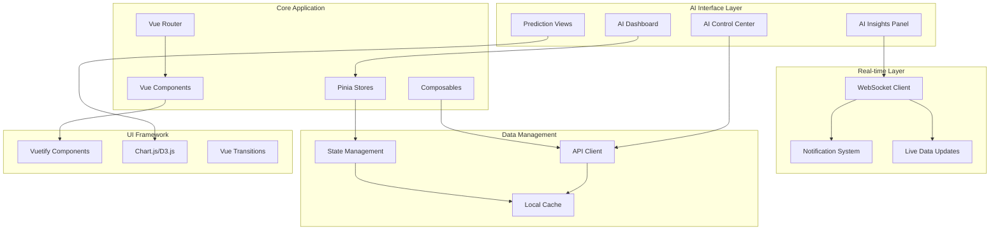
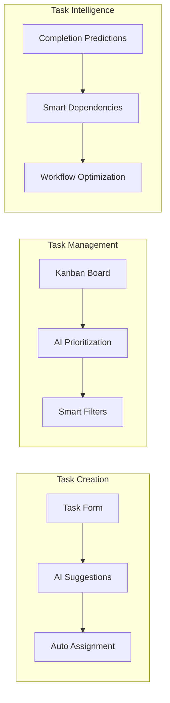

# AI-First CRM Frontend

The frontend provides an intelligent, responsive interface for the AI-First CRM platform, featuring real-time AI insights, autonomous workflow management, and predictive analytics visualization.

## Architecture Overview



## Core AI Features

### 1. AI Dashboard (`src/views/AIDashboard.vue`)
Central command center for AI-driven insights and controls:

```vue
<template>
  <v-container fluid class="ai-dashboard">
    <!-- AI Status Overview -->
    <AIStatusCard :status="aiStatus" />
    
    <!-- Real-time Insights -->
    <AIInsightsPanel :insights="liveInsights" />
    
    <!-- Workload Optimization -->
    <WorkloadOptimizer :recommendations="workloadRecs" />
    
    <!-- Predictive Analytics -->
    <PredictiveCharts :predictions="predictions" />
    
    <!-- AI Control Panel -->
    <AIControlPanel @configure="configureAI" />
  </v-container>
</template>

<script setup lang="ts">
import { ref, onMounted } from 'vue'
import { useAIStore } from '@/stores/ai'
import { useWebSocket } from '@/composables/useWebSocket'

const aiStore = useAIStore()
const { connect, subscribe } = useWebSocket()

const aiStatus = ref<AIStatus>()
const liveInsights = ref<AIInsight[]>([])
const workloadRecs = ref<WorkloadRecommendation[]>([])
const predictions = ref<PredictionData>()

onMounted(async () => {
  await aiStore.initializeAI()
  
  // Connect to AI insights WebSocket
  connect('/ws/ai-insights')
  subscribe('insight', (insight: AIInsight) => {
    liveInsights.value.unshift(insight)
  })
  
  subscribe('workload-optimization', (recs: WorkloadRecommendation[]) => {
    workloadRecs.value = recs
  })
})
</script>
```

### 2. AI-Enhanced Task Management
Tasks with intelligent automation and suggestions:



### 3. Customer Intelligence Interface
AI-driven customer insights and relationship management:

```vue
<template>
  <div class="customer-intelligence">
    <!-- Customer Overview with AI Insights -->
    <CustomerCard 
      :customer="customer"
      :ai-insights="customerInsights"
      :churn-risk="churnRisk"
      :lifetime-value="predictedLTV"
    />
    
    <!-- AI Recommendations -->
    <AIRecommendations 
      :recommendations="aiRecommendations"
      @execute="executeRecommendation"
    />
    
    <!-- Interaction Timeline with AI Analysis -->
    <InteractionTimeline 
      :interactions="interactions"
      :ai-analysis="interactionAnalysis"
    />
    
    <!-- Predictive Insights -->
    <PredictiveInsights 
      :predictions="customerPredictions"
      :confidence="predictionConfidence"
    />
  </div>
</template>
```

## Component Architecture

### AI-Enhanced Components

```
src/components/
├── ai/
│   ├── AIDashboard.vue           # Main AI control center
│   ├── AIInsightsPanel.vue       # Real-time insights display
│   ├── AIStatusCard.vue          # AI system status
│   ├── WorkloadOptimizer.vue     # Workload management
│   ├── PredictiveCharts.vue      # Prediction visualizations
│   ├── AIControlPanel.vue        # AI configuration
│   └── PatternVisualization.vue  # Pattern recognition display
├── task/
│   ├── SmartTaskForm.vue         # AI-enhanced task creation
│   ├── IntelligentKanban.vue     # AI-optimized kanban board
│   ├── TaskPredictions.vue       # Task completion predictions
│   ├── AutoAssignment.vue        # Automatic task assignment
│   └── WorkflowOptimizer.vue     # Workflow suggestions
├── customer/
│   ├── CustomerIntelligence.vue  # AI customer insights
│   ├── ChurnRiskIndicator.vue    # Churn prediction display
│   ├── LTVPredictor.vue          # Lifetime value predictions
│   ├── NextBestAction.vue        # AI action recommendations
│   └── InteractionAnalysis.vue   # Interaction pattern analysis
└── analytics/
    ├── PredictiveAnalytics.vue   # Predictive dashboards
    ├── PatternInsights.vue       # Pattern recognition results
    ├── PerformanceOptimizer.vue  # Performance recommendations
    └── AIMetrics.vue             # AI system metrics
```

## State Management with AI

### AI Store (`src/stores/ai.ts`)
Centralized AI state management:

```typescript
import { defineStore } from 'pinia'
import { ref, computed } from 'vue'
import type { 
  AIStatus, 
  AIInsight, 
  WorkloadRecommendation,
  PredictionResult,
  PatternAnalysis 
} from '@/types/ai'

export const useAIStore = defineStore('ai', () => {
  // State
  const aiStatus = ref<AIStatus>('initializing')
  const insights = ref<AIInsight[]>([])
  const workloadRecommendations = ref<WorkloadRecommendation[]>([])
  const predictions = ref<PredictionResult[]>([])
  const patterns = ref<PatternAnalysis[]>([])
  const isProcessing = ref(false)
  
  // Computed
  const activeInsights = computed(() => 
    insights.value.filter(insight => insight.status === 'active')
  )
  
  const highPriorityRecommendations = computed(() =>
    workloadRecommendations.value.filter(rec => rec.priority === 'high')
  )
  
  const predictionAccuracy = computed(() => {
    const accuratePredictions = predictions.value.filter(p => p.accuracy > 0.8)
    return accuratePredictions.length / predictions.value.length
  })
  
  // Actions
  async function initializeAI() {
    aiStatus.value = 'initializing'
    try {
      const response = await api.post('/ai/initialize')
      aiStatus.value = 'active'
      return response.data
    } catch (error) {
      aiStatus.value = 'error'
      throw error
    }
  }
  
  async function generateInsights(workspaceId: number) {
    isProcessing.value = true
    try {
      const response = await api.post(`/ai/insights/${workspaceId}`)
      insights.value = response.data
      return response.data
    } finally {
      isProcessing.value = false
    }
  }
  
  async function optimizeWorkload(workspaceId: number) {
    const response = await api.post(`/ai/optimize-workload/${workspaceId}`)
    workloadRecommendations.value = response.data
    return response.data
  }
  
  async function executeRecommendation(recommendationId: string) {
    const response = await api.post(`/ai/execute-recommendation/${recommendationId}`)
    // Update local state based on executed recommendation
    return response.data
  }
  
  async function predictCustomerBehavior(customerId: number) {
    const response = await api.get(`/ai/predict/customer/${customerId}`)
    const prediction = response.data
    predictions.value.push(prediction)
    return prediction
  }
  
  function addInsight(insight: AIInsight) {
    insights.value.unshift(insight)
    // Limit to last 100 insights
    if (insights.value.length > 100) {
      insights.value = insights.value.slice(0, 100)
    }
  }
  
  function updateAIStatus(status: AIStatus) {
    aiStatus.value = status
  }
  
  return {
    // State
    aiStatus,
    insights,
    workloadRecommendations,
    predictions,
    patterns,
    isProcessing,
    
    // Computed
    activeInsights,
    highPriorityRecommendations,
    predictionAccuracy,
    
    // Actions
    initializeAI,
    generateInsights,
    optimizeWorkload,
    executeRecommendation,
    predictCustomerBehavior,
    addInsight,
    updateAIStatus
  }
})
```

### Enhanced Task Store with AI
```typescript
export const useTaskStore = defineStore('tasks', () => {
  // ... existing task state
  
  // AI-enhanced actions
  async function autoAssignTasks(workspaceId: number) {
    const response = await api.post(`/ai/auto-assign/${workspaceId}`)
    // Update task assignments based on AI recommendations
    return response.data
  }
  
  async function optimizeTaskPriorities(workspaceId: number) {
    const response = await api.post(`/ai/optimize-priorities/${workspaceId}`)
    // Update task priorities based on AI analysis
    return response.data
  }
  
  async function predictTaskCompletion(taskId: number) {
    const response = await api.get(`/ai/predict/task/${taskId}`)
    return response.data
  }
  
  async function suggestTaskDependencies(taskId: number) {
    const response = await api.get(`/ai/suggest-dependencies/${taskId}`)
    return response.data
  }
})
```

## Real-time AI Integration

### WebSocket Composable (`src/composables/useAIWebSocket.ts`)
```typescript
import { ref, onUnmounted } from 'vue'
import { useAIStore } from '@/stores/ai'

export function useAIWebSocket() {
  const aiStore = useAIStore()
  const socket = ref<WebSocket | null>(null)
  const isConnected = ref(false)
  
  function connect() {
    const wsUrl = `${import.meta.env.VITE_WS_URL}/ws/ai`
    socket.value = new WebSocket(wsUrl)
    
    socket.value.onopen = () => {
      isConnected.value = true
      console.log('AI WebSocket connected')
    }
    
    socket.value.onmessage = (event) => {
      const data = JSON.parse(event.data)
      
      switch (data.type) {
        case 'ai_insight':
          aiStore.addInsight(data.payload)
          break
        case 'workload_optimization':
          aiStore.workloadRecommendations = data.payload
          break
        case 'prediction_update':
          aiStore.predictions.push(data.payload)
          break
        case 'pattern_detected':
          aiStore.patterns.push(data.payload)
          break
        case 'ai_status_change':
          aiStore.updateAIStatus(data.payload.status)
          break
      }
    }
    
    socket.value.onclose = () => {
      isConnected.value = false
      console.log('AI WebSocket disconnected')
      // Attempt to reconnect after 5 seconds
      setTimeout(connect, 5000)
    }
  }
  
  function disconnect() {
    if (socket.value) {
      socket.value.close()
      socket.value = null
      isConnected.value = false
    }
  }
  
  onUnmounted(() => {
    disconnect()
  })
  
  return {
    connect,
    disconnect,
    isConnected
  }
}
```

## AI Visualization Components

### Predictive Charts (`src/components/ai/PredictiveCharts.vue`)
```vue
<template>
  <v-card class="predictive-charts">
    <v-card-title>AI Predictions & Insights</v-card-title>
    
    <v-tabs v-model="activeTab">
      <v-tab value="sales">Sales Forecast</v-tab>
      <v-tab value="churn">Churn Risk</v-tab>
      <v-tab value="workload">Workload Optimization</v-tab>
      <v-tab value="patterns">Pattern Analysis</v-tab>
    </v-tabs>
    
    <v-window v-model="activeTab">
      <v-window-item value="sales">
        <SalesForecastChart :data="salesPredictions" />
      </v-window-item>
      
      <v-window-item value="churn">
        <ChurnRiskChart :data="churnPredictions" />
      </v-window-item>
      
      <v-window-item value="workload">
        <WorkloadOptimizationChart :data="workloadData" />
      </v-window-item>
      
      <v-window-item value="patterns">
        <PatternAnalysisChart :data="patternData" />
      </v-window-item>
    </v-window>
  </v-card>
</template>

<script setup lang="ts">
import { ref, computed, onMounted } from 'vue'
import { useAIStore } from '@/stores/ai'

const aiStore = useAIStore()
const activeTab = ref('sales')

const salesPredictions = computed(() => 
  aiStore.predictions.filter(p => p.type === 'sales_forecast')
)

const churnPredictions = computed(() =>
  aiStore.predictions.filter(p => p.type === 'churn_risk')
)

const workloadData = computed(() =>
  aiStore.workloadRecommendations
)

const patternData = computed(() =>
  aiStore.patterns
)
</script>
```

## TypeScript Types for AI

### AI Type Definitions (`src/types/ai.ts`)
```typescript
export interface AIStatus {
  status: 'initializing' | 'active' | 'processing' | 'error' | 'maintenance'
  lastUpdate: string
  version: string
  capabilities: string[]
}

export interface AIInsight {
  id: string
  type: 'pattern' | 'prediction' | 'optimization' | 'alert'
  title: string
  description: string
  confidence: number
  priority: 'low' | 'medium' | 'high' | 'critical'
  data: Record<string, any>
  recommendations: AIRecommendation[]
  createdAt: string
  status: 'active' | 'dismissed' | 'executed'
}

export interface AIRecommendation {
  id: string
  type: 'task_assignment' | 'priority_change' | 'resource_allocation' | 'process_optimization'
  title: string
  description: string
  impact: 'low' | 'medium' | 'high'
  effort: 'low' | 'medium' | 'high'
  expectedOutcome: string
  confidence: number
  actions: AIAction[]
}

export interface AIAction {
  id: string
  type: string
  parameters: Record<string, any>
  description: string
}

export interface PredictionResult {
  id: string
  type: 'sales_forecast' | 'churn_risk' | 'task_completion' | 'customer_ltv'
  entityId: number
  entityType: 'customer' | 'task' | 'workspace' | 'user'
  prediction: any
  confidence: number
  accuracy?: number
  timeframe: string
  createdAt: string
}

export interface PatternAnalysis {
  id: string
  type: 'behavioral' | 'temporal' | 'performance' | 'workflow'
  pattern: string
  description: string
  frequency: number
  significance: number
  affectedEntities: string[]
  recommendations: string[]
  detectedAt: string
}

export interface WorkloadRecommendation {
  id: string
  type: 'task_redistribution' | 'capacity_adjustment' | 'skill_matching' | 'deadline_optimization'
  title: string
  description: string
  priority: 'low' | 'medium' | 'high'
  impact: {
    efficiency: number
    satisfaction: number
    quality: number
  }
  affectedUsers: number[]
  affectedTasks: number[]
  implementation: AIAction[]
}
```

## Routing with AI Features

### AI-Enhanced Router (`src/router/index.ts`)
```typescript
import { createRouter, createWebHistory } from 'vue-router'
import { useAuthStore } from '@/stores/auth'
import { useAIStore } from '@/stores/ai'

const routes = [
  {
    path: '/ai-dashboard',
    name: 'AIDashboard',
    component: () => import('@/views/AIDashboard.vue'),
    meta: { requiresAuth: true, requiresAI: true }
  },
  {
    path: '/workspace/:id/ai-insights',
    name: 'WorkspaceAIInsights',
    component: () => import('@/views/WorkspaceAIInsights.vue'),
    meta: { requiresAuth: true, requiresAI: true }
  },
  {
    path: '/customers/:id/ai-analysis',
    name: 'CustomerAIAnalysis',
    component: () => import('@/views/CustomerAIAnalysis.vue'),
    meta: { requiresAuth: true, requiresAI: true }
  }
]

const router = createRouter({
  history: createWebHistory(),
  routes
})

router.beforeEach(async (to, from, next) => {
  const authStore = useAuthStore()
  const aiStore = useAIStore()
  
  if (to.meta.requiresAuth && !authStore.isAuthenticated) {
    next('/login')
    return
  }
  
  if (to.meta.requiresAI && aiStore.aiStatus !== 'active') {
    await aiStore.initializeAI()
  }
  
  next()
})

export default router
```

## Performance Optimization

### AI Data Caching
```typescript
// Composable for AI data caching
export function useAICache() {
  const cache = new Map<string, { data: any; timestamp: number; ttl: number }>()
  
  function set(key: string, data: any, ttl = 300000) { // 5 minutes default
    cache.set(key, {
      data,
      timestamp: Date.now(),
      ttl
    })
  }
  
  function get(key: string) {
    const item = cache.get(key)
    if (!item) return null
    
    if (Date.now() - item.timestamp > item.ttl) {
      cache.delete(key)
      return null
    }
    
    return item.data
  }
  
  return { set, get }
}
```

### Lazy Loading AI Components
```typescript
// Lazy load AI components for better performance
const AIDashboard = defineAsyncComponent(() => import('@/components/ai/AIDashboard.vue'))
const AIInsightsPanel = defineAsyncComponent(() => import('@/components/ai/AIInsightsPanel.vue'))
const PredictiveCharts = defineAsyncComponent(() => import('@/components/ai/PredictiveCharts.vue'))
```

## Development Setup

### Environment Configuration
```bash
# .env.development
VITE_API_URL=http://localhost:8000
VITE_WS_URL=ws://localhost:8000
VITE_AI_ENABLED=true
VITE_AI_POLLING_INTERVAL=30000
VITE_PREDICTION_CACHE_TTL=300000
```

### Build Configuration
```typescript
// vite.config.ts
export default defineConfig({
  plugins: [
    vue(),
    vuetify()
  ],
  define: {
    __AI_ENABLED__: process.env.VITE_AI_ENABLED === 'true'
  },
  build: {
    rollupOptions: {
      output: {
        manualChunks: {
          'ai-components': [
            './src/components/ai/AIDashboard.vue',
            './src/components/ai/AIInsightsPanel.vue',
            './src/components/ai/PredictiveCharts.vue'
          ]
        }
      }
    }
  }
})
```

This frontend architecture provides a comprehensive, AI-first user experience with real-time insights, predictive analytics, and intelligent automation seamlessly integrated into the CRM workflow.